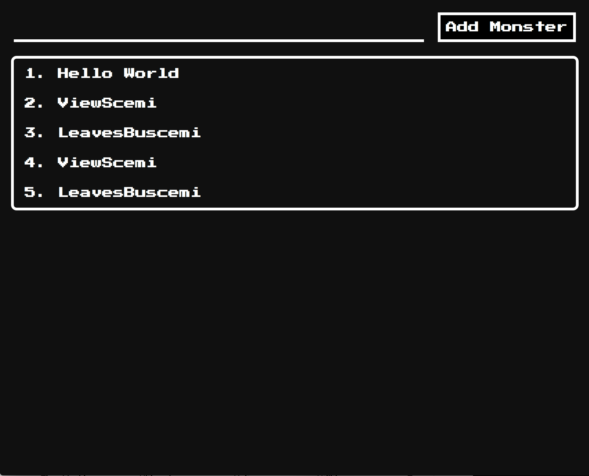

# Shmonsters: A tool for making retro-style beastiaries

Shmonsters is a web application that lets you make beastiaries like you'd see in older RPGs. 

## Features

### Create New Monsters

You can add new monsters by entering a name in the top field. This will then redirect you to the edit screen.

### Make Pixel Art

(Coming Soon) - Make your monster using a simple pixel art tool

### Edit Monsters

Clicking on a monster will bring you to the Edit page, where you can customize your monster

### Edit Monster Templates

(Coming Soon) - By default, monsters only have a name and description, but you can add new fields by editing the template file

### Export Your Data

(Coming Soon) - By default, this application stores your data in the browser, no server backup! If you want to backup your data or move it between devices, you can download a JSON file containing all your work up to that point